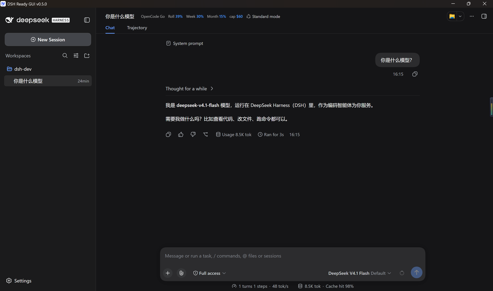
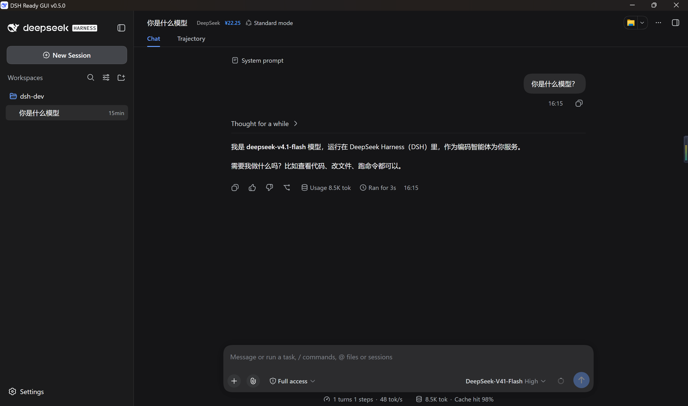
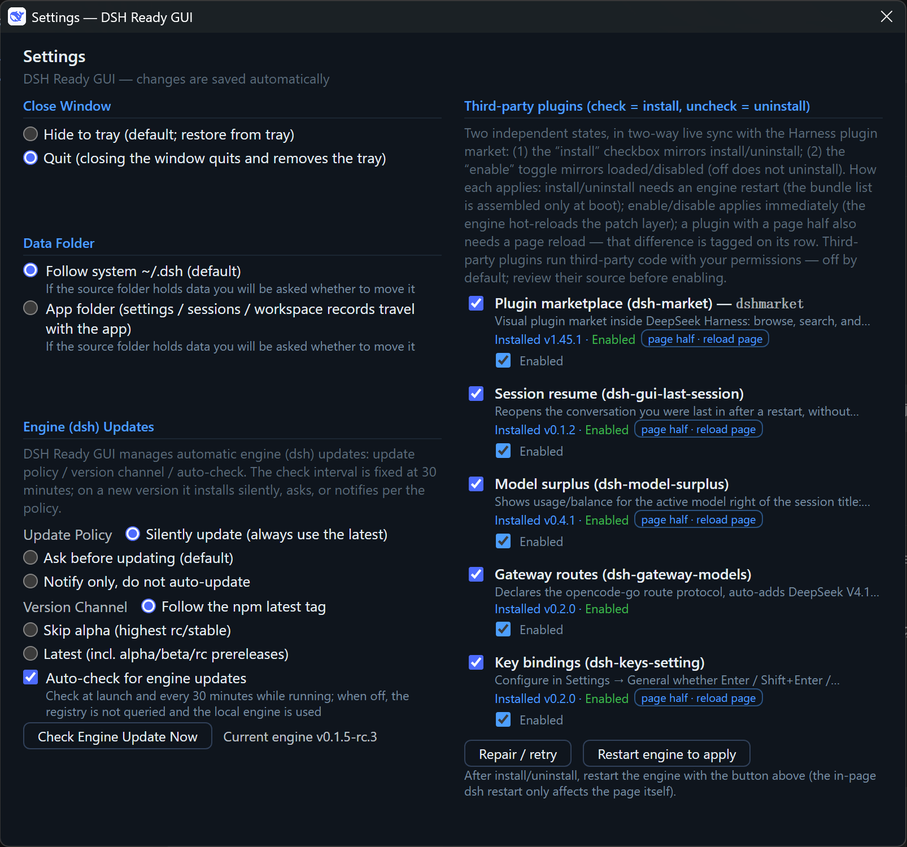
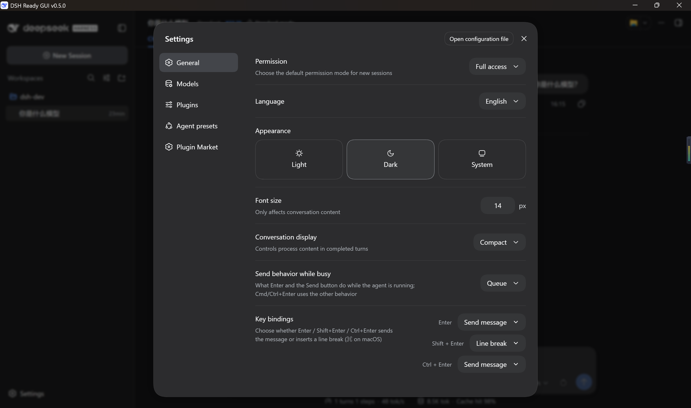
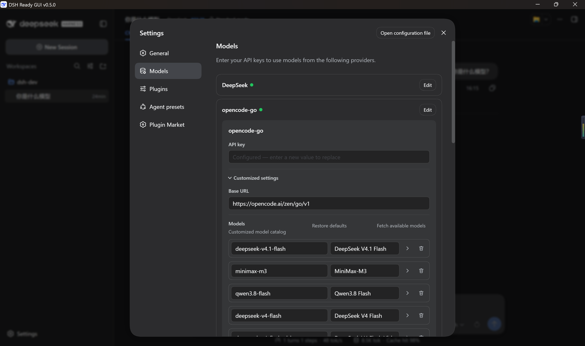

# DSH Ready GUI

> A desktop shell for DeepSeek Harness (DSH) on Windows, macOS and Linux: **open it and you have a UI — no command line.**

[](README.md)
[](README.en.md)
[](LICENSE)
[](https://github.com/itchenshi/dsh-ready-gui/releases)
[](https://github.com/itchenshi/dsh-ready-gui/stargazers)
[]()
[](https://github.com/itchenshi/dsh-ready-gui)
[](https://gitee.com/itchenshi/dsh-ready-gui)
[](https://gitcode.com/itchenshi/dsh-ready-gui)

DSH itself is an open-source agent framework (`@deepseek-ai/dsh`) that ships as a CLI and a web UI.
This shell puts it in a native window: **it installs and updates the engine for you, your data stays
yours, and closing the window leaves one tray icon.**

## Open it and go

| What you want | How it works here |
|---|---|
| No command line | Double-click the app. The shell downloads and installs the engine itself (1–2 min on first run, progress on the status page) |
| No update babysitting | It checks on every launch and **asks** before updating by default; it also notifies you when DSH Ready GUI itself has a new version |
| No model wiring | Tick a box in **Settings → Third-party plugins** and the bundled plugins are there: model surplus, session resume, gateway routes, key bindings |
| Don't lose my conversation | Restarting reopens the conversation you were last in (bundled "session resume") |
| Don't let anything else read my account | The shell binds to loopback only, and the plugins' own HTTP routes are authenticated — a bare `curl` gets 401 instead of your usage and balance |
| Take my data with me | The data directory is switchable (default: system `~/.dsh`) and migration is offered when you switch |

Each bundled plugin is also its own repository (installable into any other DSH host):

| Plugin | One line | Repo |
|---|---|---|
| Model surplus `dsh-model-surplus` | Usage / account balance for the active model, right of the session title | [repo](https://github.com/itchenshi/dsh-model-surplus) |
| Session resume `dsh-gui-last-session` | Reopens your last conversation after a restart | [repo](https://github.com/itchenshi/dsh-gui-last-session) |
| Gateway routes `dsh-gateway-models` | Declares the OpenCode Go / Command Code route protocol and endpoint, and completes their model lists | [repo](https://github.com/itchenshi/dsh-gateway-models) |
| Key bindings `dsh-keys-setting` | Enter / Shift+Enter / Ctrl+Enter each set to send or newline | [repo](https://github.com/itchenshi/dsh-keys-setting) |

> **Why bundled instead of installed from npm?** The plan was to publish them, so plugin updates would
> not wait for a shell release. npm account sign-up is unreachable (`www.npmjs.com` answers with a
> Cloudflare challenge), so nothing can be published — and a profile that registers a package the
> registry does not have loses the plugin from the engine's bundle list *and* fails every later install
> in that profile (both measured). So they stay **bundled**: install the GUI and they are one tick away.

## Screenshots

**Main window**: the **model surplus** sits right of the session title and follows whichever model you
select — OpenCode Go plan usage (rolling / weekly / monthly percentages plus reset times) and the
**active model's** total cap, Command Code 5-hour / weekly window usage with remaining credits, or your
DeepSeek account balance.

| OpenCode Go usage and model cap | DeepSeek balance |
|---|---|
|  |  |

**Settings window**: engine updates, third-party plugins, and data & desktop, all in one place.

| Settings window |
|---|
|  |

**DSH settings dialog**: the engine's own settings plus the rows the bundled plugins add.

**Key bindings** on the General page — Enter / Shift+Enter / Ctrl+Enter each set to send or newline:

| Key bindings (DSH Settings → General) |
|---|
|  |

On the **models page**, `deepseek-v4.1-flash` under `opencode-go` was **detected, added and hoisted to
the top by the plugin** — it is the first entry right after install, with nothing added by hand. The
Command Code route gets both its endpoint and its whole model list (81 models) declared and completed
the same way — nothing to type:

| Auto-added V4.1 model (DSH Settings → Models) |
|---|
|  |

## Install

**From a release** — download from [Releases](https://github.com/itchenshi/dsh-ready-gui/releases) and
open it.

All three platforms have a release page, but **installers live on GitHub only**: producing Windows, macOS
and Linux artifacts at once needs three kinds of runner, which only GitHub Actions provides.
[Gitee](https://gitee.com/itchenshi/dsh-ready-gui/releases) and
[GitCode](https://gitcode.com/itchenshi/dsh-ready-gui/releases) publish **source archives and the release
notes**; download the installer from GitHub (Gitee's free tier caps attachments at 100 MB per file and
1 GB per repository, while our installers are 133–194 MB).

**From source** (development only; needs [Node.js](https://nodejs.org/) ≥ 23 — packaged builds ship
their own portable Node, so end users install nothing):

```sh
npm install    # electron / build dependencies
npm start      # launch
```

Two things worth doing on first launch: tick the plugins you want in **Settings → Third-party
plugins**, and pick your language and theme in the **Harness page → Settings** (the shell follows
live, no restart).

## Settings window

| Page | What it changes | Default |
|---|---|---|
| Engine updates | Update policy / channel / automatic checks | **Ask before updating** · npm latest · checks on |
| Third-party plugins | Per-plugin "install" checkbox + "enabled" switch | Mirrors the real state |
| Data & desktop | Data directory, close behaviour (hide to tray / quit), reopen last conversation | System `~/.dsh` · hide to tray · on |
| Language & appearance | Not here — set it in the **Harness page → Settings**; the shell follows live | — |

The two plugin controls:

- **Install** — whether it is installed at all. Ticking installs immediately, unticking uninstalls
  (the same mechanism the plugin market in the Harness page uses).
- **Enabled** — whether the engine loads it. Turning it off does **not** uninstall it, and it stays in
  sync with the plugin market both ways.
- **How changes take effect**: install/uninstall needs an **engine restart** (the engine assembles
  plugins at startup); enable/disable is hot-reloaded **immediately**; plugins with a page half (model
  surplus, session resume, key bindings) also need a **page refresh** — the settings row shows a
  "refresh page" button for those.

## Where your data lives

All of it under `$DSH_HOME` (default `~/.dsh`; switchable to the app directory in Settings):

| What | Path |
|---|---|
| Model / system / plugin settings | `<DSH_HOME>/settings.yaml` |
| Conversation history | `<DSH_HOME>/sessions/…` |
| Workspace records | `<DSH_HOME>/storages/` (your workspace files stay in their real directories) |
| Profile and plugins | `<DSH_HOME>/profiles/web/…` |
| Credentials | `<DSH_HOME>/.credentials.yaml` |

The GUI's own preferences (window behaviour, data directory, update policy) live in
`<userData>/settings.json`. The embedded page uses an in-memory session, so every launch starts clean,
and quitting kills the whole child process tree.

## FAQ

- **First launch sits on "downloading and installing…"** — that is the DeepSeek Harness engine being
  installed, once, for 1–2 minutes.
- **A plugin/engine change did not take effect** — install/uninstall needs an engine restart (the
  settings window has a "restart engine" action and tells you when it is needed); language and theme
  are changed in the Harness page and apply live.
- **I switched the data directory and my old conversations are gone** — the switch offers to move the
  data; choosing "switch only" leaves it in the original location.
- **`npm run dist` fails on Windows with `mksquashfs ENOENT`** — AppImage can only be built on
  Linux/macOS (or CI/Docker).
- **How does this relate to the official CLI?** The shell is a launcher; the process it runs is the
  official `@deepseek-ai/dsh`. For Harness capabilities, see the
  [official docs](https://deepseek-harness.github.io/deepseek-harness/guide/quickstart).

## For developers

Architecture and data flow:

```
start → single-instance lock → read settings.json + Harness theme → create window (maximized, in-memory session)
   └─ boot()
       ├─ resolve Node: bundled portable → $DSH_SHELL_NODE → system PATH
       ├─ check/install the engine when needed (npm registry, per policy)
       ├─ reconcile installed directory plugins (refresh bundled ones; leave hand-installed ones alone)
       ├─ clean up renamed legacy plugins (bundle + dependencies, so two copies never load at once)
       ├─ spawn dsh web --no-open --port 0 → parse the URL from stdout → load it in the window
       └─ on quit: kill the process tree + destroy the tray
```

```
├─ src/                 # source
│  ├─ main.js           # main process: engine updates, window, tray, settings, data migration
│  ├─ plugin-manager.js # third-party plugins (catalog + dsh plugin install reconciliation)
│  ├─ engine-patch.js   # idempotent fallback patch for the engine page
│  ├─ preload.js / workspace-preload.js  # the two IPC bridges (settings window / narrow main-window bridge)
│  ├─ settings.html / status.html / notice.html
│  └─ home-migrate.js   # data-directory detection and migration (pure Node, unit-tested)
├─ plugins/             # the four bundled plugin copies (**generated**, synced from plugin-repos/)
├─ scripts/             # build, release, sync and smoke scripts
├─ marketing/           # promotional material (one directory per version)
├─ electron-builder.yml
└─ dist/                # build output (gitignored)
```

### Plugin sources → bundled copies

The plugins live in sibling repositories; `plugins/` here is their bundled copy:

```
dsh-dev/
├─ dsh-ready-gui/     # this repository
└─ plugin-repos/      # the four plugin repositories
```

```sh
npm run sync:plugins                             # plugin repos → plugins/ (full mirror)
node scripts/sync-bundled-plugins.mjs --check    # drift check, exit code 1 on drift (for CI)
```

- **Edit plugins in `plugin-repos/<name>/`**, then `npm run sync:plugins`. **Do not hand-edit
  `plugins/`** — the next sync overwrites it.
- The plugin repositories are found automatically (`dsh-dev/plugin-repos`, a sibling directory of this
  repository, or `plugin-repos/` inside it); override with `--repos <dir>` or `DSH_PLUGIN_REPOS`.
- **Bump `version` when you change plugin code**: the GUI replaces an installed copy only when the
  bundled version is newer, so an equal version is left alone (that keeps a user-updated copy from
  being silently downgraded).
- `npm run dist:*` runs the sync first, so a release can never ship stale plugins.

### Build and test

```sh
npm test               # all unit tests
npm run test:e2e       # Windows end-to-end (close a running instance first)
npm run verify:builtin # bundled-plugin self-healing check (temp DSH_HOME, real engine + real pnpm)
npm run dist:win       # Windows: installer + portable zip
npm run dist:mac       # macOS (must run on macOS)
npm run dist:linux     # Linux
```

Optional environment variables: `DSH_SHELL_NODE` (the node used for the engine), `DSH_SHELL_HOME`
(isolated `DSH_HOME`), `DSH_SHELL_USERDATA`, `DSH_SHELL_REGISTRY_URL`, `DSH_NODE_VERSION` /
`DSH_NODE_MIRROR` (for packaging).

## License

[MIT](LICENSE) · An independent open-source shell, not affiliated with the DeepSeek Harness project;
DeepSeek Harness itself is [MIT](https://github.com/deepseek-ai/deepseek-harness) licensed.
