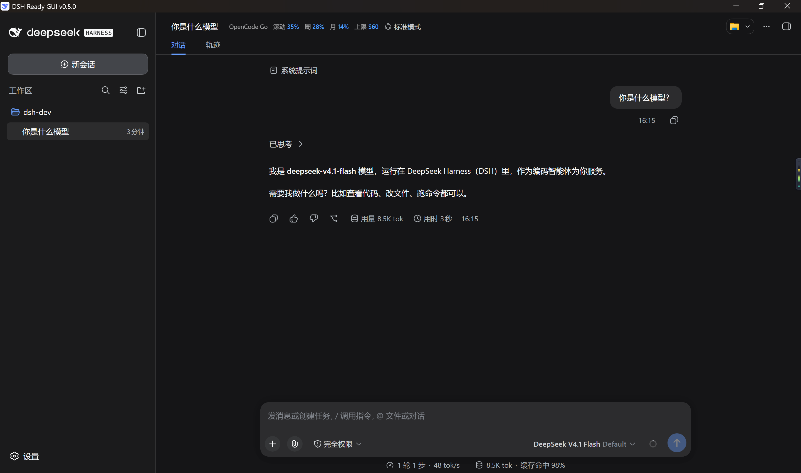
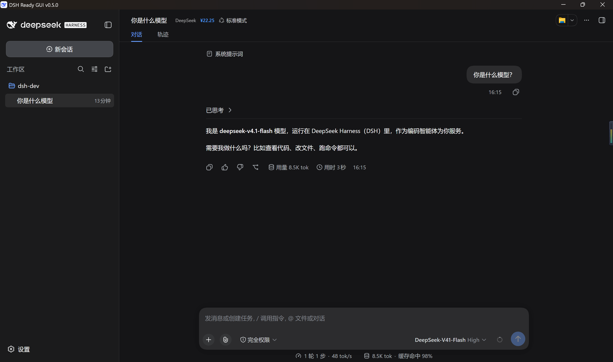
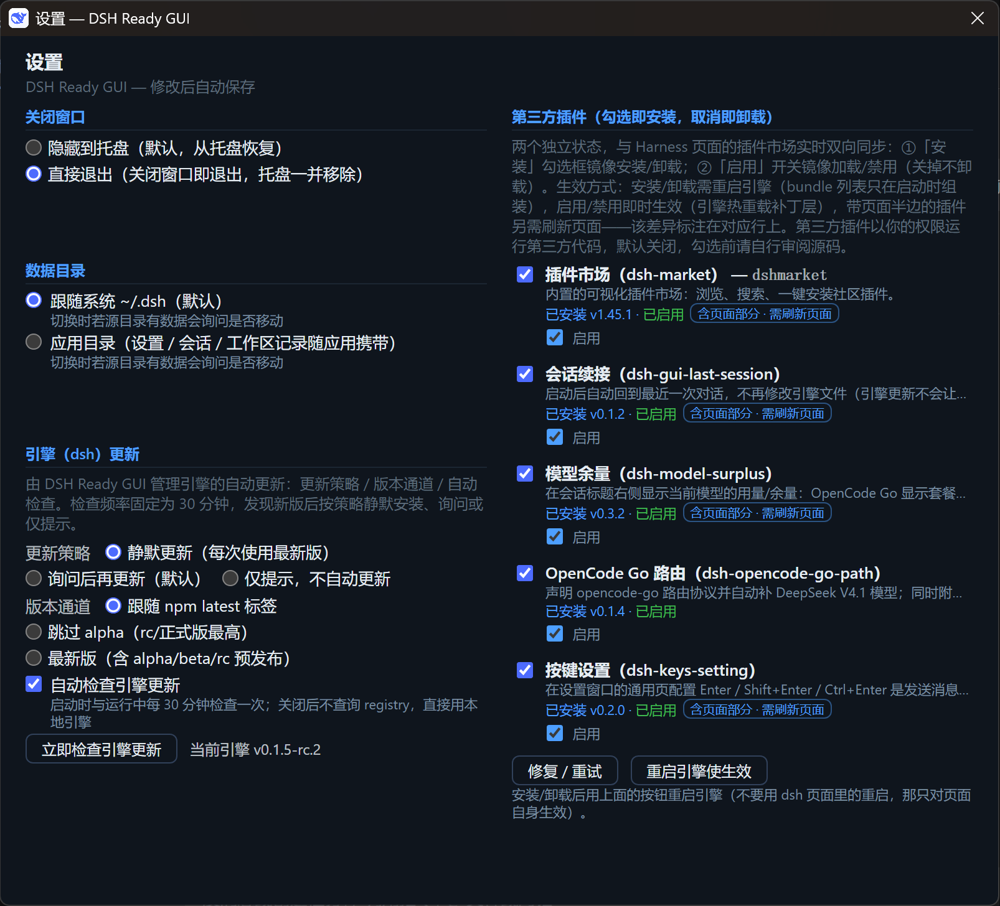
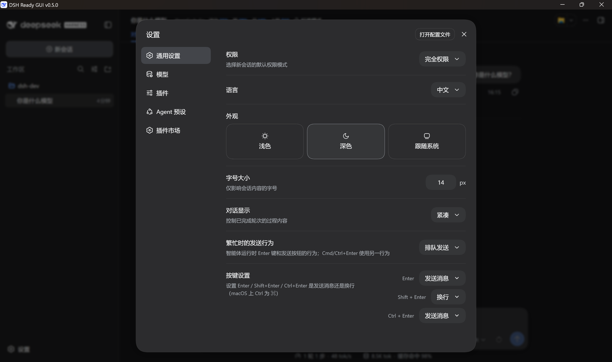
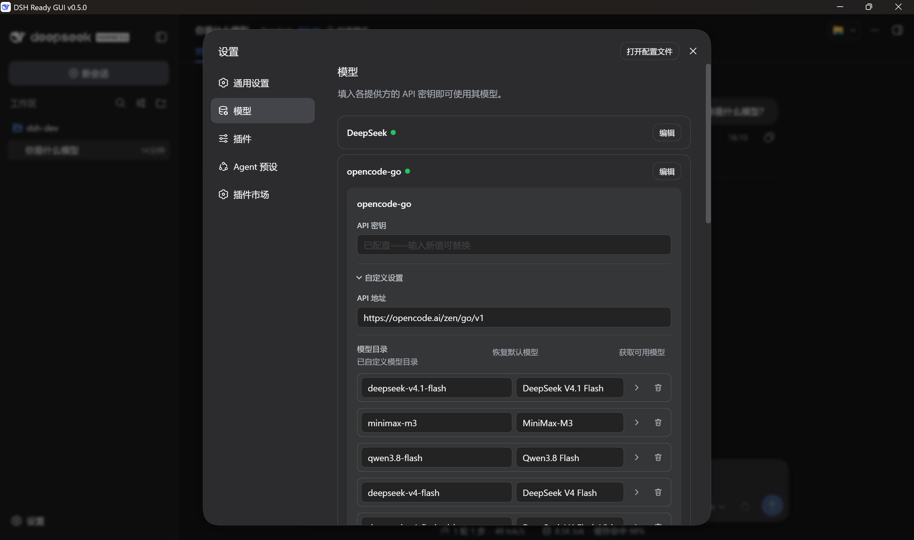

# DSH Ready GUI

> DeepSeek Harness（DSH）的 Windows 桌面壳：**装上就有界面，不用碰命令行。**

[](README.en.md)
[](README.md)
[](LICENSE)
[](https://github.com/itchenshi/dsh-ready-gui/releases)
[](https://github.com/itchenshi/dsh-ready-gui/stargazers)
[]()
[](https://github.com/itchenshi/dsh-ready-gui)
[](https://gitee.com/itchenshi/dsh-ready-gui)
[](https://gitcode.com/itchenshi/dsh-ready-gui)

DSH 本体是一套开源 Agent 框架（`@deepseek-ai/dsh`），官方只给命令行和网页。这个壳把它装进一个
原生窗口：**引擎它自己装、自己升级，数据在你自己手里，关掉就是托盘里的一个图标。**

## 打开就能用

| 你想要 | 这里怎么做 |
|---|---|
| 不想敲命令 | 双击应用图标就完事。引擎由壳自己下载安装（首次 1–2 分钟，状态页有进度） |
| 不想管升级 | 每次启动都自动检查，默认「问你要不要更新」；DSH Ready GUI 自己有新版也会通知你 |
| 不想配模型 | 装好内置插件，在「设置窗口 → 第三方插件」勾一下就有：模型余量、会话续接、OpenCode Go 路由、按键设置 |
| 不想丢会话 | 重启后自动回到你上次那个对话（内置「会话续接」） |
| 不想被人乱看 | 壳只监听本机回环地址；插件自己的 HTTP 路由都开了鉴权，裸 `curl` 拿不到你的用量和余额 |
| 想搬走数据 | 数据目录可切换（默认跟随系统 `~/.dsh`），切换时问你要不要一起搬，会话记录跟着走 |

四个内置插件各自也是独立仓库（可以单独装到别的 DSH 宿主）：

| 插件 | 一句话 | 仓库 |
|---|---|---|
| 模型余量 `dsh-model-surplus` | 会话标题右侧显示当前模型的用量 / 账户余额 | [仓库](https://github.com/itchenshi/dsh-model-surplus) |
| 会话续接 `dsh-gui-last-session` | 重启后回到上次那个对话 | [仓库](https://github.com/itchenshi/dsh-gui-last-session) |
| OpenCode Go 路由 `dsh-opencode-go-path` | 自动补齐 DeepSeek V4.1 模型 + 附加会话头，修 400 | [仓库](https://github.com/itchenshi/dsh-opencode-go-path) |
| 按键设置 `dsh-keys-setting` | Enter / Shift+Enter / Ctrl+Enter 各自设成发送或换行 | [仓库](https://github.com/itchenshi/dsh-keys-setting) |

> **它们为什么内置、而不是从 npm 装？** 原计划是发布到 npm，让插件更新不必等壳发版。但 npm
> 账号注册走不通（`www.npmjs.com` 返回 Cloudflare 托管挑战），包发不出去；而 profile 里登记一个
> registry 上没有的包，会让插件直接从引擎的 bundle 列表里消失，并让这个 profile 里每一次安装
> 操作一起失败（都实测到了）。所以**保持内置**：装上 GUI 就有，勾选即在，不需要命令行。

## 界面预览

**主窗口**：会话标题右侧就是**模型余量**，跟着你选的模型自动切换 —— 用 OpenCode Go 时显示套餐用量
（滚动 / 周 / 月百分比 + 重置时间）和**当前模型**的总额上限，用 DeepSeek 时显示账户余额。

| OpenCode Go 余量与模型总额 | DeepSeek 余额 |
|---|---|
|  |  |

**设置窗口**：引擎更新、第三方插件、数据与桌面，一个窗口管完。

| 设置窗口 |
|---|
|  |

**DSH 设置弹窗**：除了引擎自己的设置项，还有内置插件加的行。

「通用」页的**按键设置** —— Enter / Shift+Enter / Ctrl+Enter 各自设成发送还是换行：

| 按键设置（DSH 设置 → 通用） |
|---|
|  |

**模型页**里，`opencode-go` 的 `deepseek-v4.1-flash` 是插件**自动检测目录、补进列表并置顶**的
—— 装完就排在第一项，不用手动添加：

| 自动添加 V4.1 模型（DSH 设置 → 模型） |
|---|
|  |

## 安装

**用安装包** —— 到 [Releases](https://github.com/itchenshi/dsh-ready-gui/releases) 下载，装完打开即可
（三平台镜像：[GitHub](https://github.com/itchenshi/dsh-ready-gui) · [Gitee](https://gitee.com/itchenshi/dsh-ready-gui) · [GitCode](https://gitcode.com/itchenshi/dsh-ready-gui)，安装包以 GitHub Releases 为准）。

**从源码跑**（只有开发需要；要 [Node.js](https://nodejs.org/) ≥ 23，打包产物自带便携 Node，终端用户无需安装任何运行时）：

```sh
npm install    # electron / 构建依赖
npm start      # 启动
```

打开后建议顺手做两件事：**设置窗口 → 第三方插件** 勾上你想要的四个插件；**Harness 页面 → 设置**
里选语言和主题（外壳会实时跟随，不用重启）。

## 设置窗口

| 页 | 能改什么 | 默认 |
|---|---|---|
| 引擎更新 | 更新策略 / 版本通道 / 是否自动检查 | **询问后再更新** · npm latest · 自动检查开 |
| 第三方插件 | 每个插件的「安装」勾选框 + 「启用」开关 | 跟随实际状态 |
| 数据与桌面 | 数据目录、关窗行为（隐藏到托盘 / 直接退出）、自动回到最近对话 | 跟随系统 `~/.dsh` · 隐藏到托盘 · 开 |
| 语言与外观 | 不在这里改 —— 在 **Harness 页面 → 设置** 里改，外壳实时跟随 | — |

关于插件的两个开关：

- **「安装」** = 装没装。勾上立即装、取消立即卸（与 Harness 页面的插件市场是同一套机制）。
- **「启用」** = 引擎加不加载它。关掉**不卸载**，只是不加载；与插件市场双向实时同步。
- **生效方式**：装卸要**重启引擎**（引擎只在启动时组装插件）；启用/禁用是热重载**即时**生效；
  带页面部分的插件（模型余量、会话续接、按键设置）还需要**刷新 Harness 页面**——设置窗口会在那
  一行显示「刷新页面」按钮。

## 数据放在哪

全部在 `$DSH_HOME`（默认 `~/.dsh`，可在设置里切到应用目录）：

| 内容 | 路径 |
|---|---|
| 模型 / 系统 / 插件设置 | `<DSH_HOME>/settings.yaml` |
| 会话历史 | `<DSH_HOME>/sessions/…` |
| 工作区记录 | `<DSH_HOME>/storages/`（工作区业务文件仍在你的真实目录里） |
| profile 与插件 | `<DSH_HOME>/profiles/web/…` |
| 凭证 | `<DSH_HOME>/.credentials.yaml` |

GUI 自己的偏好（窗口行为、数据目录、更新策略）在 `<userData>/settings.json`。
内嵌页面用内存会话，每次启动都是干净的；退出时连子进程一起清理。

## 常见问题

- **第一次启动卡在「正在下载并安装…」**：在装 DeepSeek Harness 引擎，仅首次，1–2 分钟。
- **改了插件/引擎的东西没生效**：装卸插件要重启引擎（设置窗口有「重启引擎使生效」，环境不对时它
  会告诉你）；语言/主题在 Harness 页面改，即时生效。
- **切了数据目录，旧会话不见了**：切换时若源目录有数据会问你要不要搬；选「仅切换」的话数据留在
  原位置。
- **`npm run dist` 在 Windows 报 `mksquashfs ENOENT`**：AppImage 只能在 Linux/macOS（或 CI/Docker）构建。
- **和官方 CLI 什么关系**：这个壳只是启动器，跑的还是官方 `@deepseek-ai/dsh`；Harness 本身的能力
  问题请看 [官方文档](https://deepseek-harness.github.io/deepseek-harness/guide/quickstart)。

## 开发者

架构与数据流：

```
启动 → 单实例锁 → 读 settings.json + Harness 主题 → 建窗口（最大化，内存会话）
   └─ boot()
       ├─ 解析 Node：捆绑便携版 → $DSH_SHELL_NODE → 系统 PATH
       ├─ 需要时检查/安装引擎（npm registry，按策略）
       ├─ 启动前对账已装的目录插件（补拉捆绑插件更新；不动用户手动装的）
       ├─ 清理已改名的旧插件（摘 bundle + dependencies，避免新旧两份同时加载）
       ├─ spawn dsh web --no-open --port 0 → 解析 stdout 的 URL → 内嵌加载
       └─ 退出：kill 进程树 + 销毁托盘
```

```
├─ src/                 # 源码
│  ├─ main.js           # 主进程：引擎更新、窗口、托盘、设置、数据迁移
│  ├─ plugin-manager.js # 第三方插件（catalog + dsh plugin 安装对账）
│  ├─ engine-patch.js   # 引擎页面兜底补丁（幂等）
│  ├─ preload.js / workspace-preload.js  # 两条 IPC 桥（设置窗口 / 主窗口窄桥）
│  ├─ settings.html / status.html / notice.html
│  └─ home-migrate.js   # 数据目录检测与迁移（纯 Node，可单测）
├─ plugins/             # 四个内置插件副本（**生成物**，由 plugin-repos/ 同步而来）
├─ scripts/             # 构建、发布、同步、冒烟脚本
├─ marketing/           # 推广物料（按版本分目录）
├─ electron-builder.yml
└─ dist/                # 构建产物（已 gitignore）
```

### 插件源码 → 内置副本

插件在旁边的独立仓库里，本仓库的 `plugins/` 是它们的内置副本：

```
dsh-dev/
├─ dsh-ready-gui/     # 本仓库
└─ plugin-repos/      # 四个插件仓库
```

```sh
npm run sync:plugins                             # 插件仓库 → plugins/（全量镜像）
node scripts/sync-bundled-plugins.mjs --check    # 只查漂移，不一致退出码 1（CI 用）
```

- **改插件请改 `plugin-repos/<名字>/`**，然后 `npm run sync:plugins`；**不要手改 `plugins/`**（会被覆盖）。
- 插件仓库位置自动查找（`dsh-dev/plugin-repos`、旁边的同名目录、本仓库内 `plugin-repos/`），也可用
  `--repos <目录>` 或 `DSH_PLUGIN_REPOS` 指定。
- **改了插件代码记得提 `version`**：GUI 只在「随包版本比已装的新」时才替换已装副本，同版本不重装
  （为了不把用户更新过的副本无人值守降级）。
- `npm run dist:*` 会先跑同步，所以发布产物不会带着旧插件。

### 打包与测试

```sh
npm test              # 全部单测
npm run test:e2e      # Windows 端到端（先关掉正在运行的实例）
npm run verify:builtin # 内置插件自愈验证（临时 DSH_HOME，真引擎 + 真 pnpm）
npm run dist:win      # Windows：安装包 + 便携 zip
npm run dist:mac      # macOS（需在 macOS 上跑）
npm run dist:linux    # Linux
```

可选环境变量：`DSH_SHELL_NODE`（指定引擎用的 node）、`DSH_SHELL_HOME`（隔离 `DSH_HOME`）、
`DSH_SHELL_USERDATA`、`DSH_SHELL_REGISTRY_URL`、`DSH_NODE_VERSION` / `DSH_NODE_MIRROR`（打包用）。

## 许可

[MIT](LICENSE) · 独立开源外壳，与 DeepSeek Harness 官方项目无隶属关系；
DeepSeek Harness 本身为 [MIT](https://github.com/deepseek-ai/deepseek-harness) 许可。
